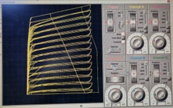

# Curve Tracer Report

## Table of Contents

1. [Introduction and Functionality](#introduction-and-functionality)
2. [System Architecture](#system-architecture)
3. [Component Selection](#component-selection)
4. [PCB Design](#pcb-design)
5. [Enclosure Design](#enclosure-design)
6. [Software Simulation and Hardware Testing](#software-simulation-and-hardware-testing)
7. [Conclusion & Future Works](#conclusion--future-works)
8. [Contribution of Group Members](#contribution-of-group-members)
9. [References](#references)

---

## Introduction and Functionality

The Curve Tracer project aims to visualize the electrical characteristics of various electronic components and systems. It involves interconnecting simple and modular circuits to achieve the desired functionality. The device operates by varying the voltage across the Device Under Test (DUT) and measuring the current through it. The report discusses the basic concept, motivation, and design approach of the Curve Tracer.

---

## System Architecture

The Curve Tracer system is divided into five subsystems: Astable multivibrator, Relaxation oscillator, Integrator, Ramp Generator, and Current mirror. Each subsystem plays a crucial role in generating and controlling the waveforms required for testing electronic components. The report provides detailed insights into the functionality and design considerations of each subsystem.

---

## Component Selection

This section covers the process of selecting components for the Curve Tracer project. It discusses the initial component recommendations, changes made based on availability and price, and the criteria used for evaluating component suitability. A list of components used in the project along with their models and comments is provided for reference.

---

## PCB Design

The PCB design plays a vital role in the functionality and reliability of the Curve Tracer device. This section presents the Altium Designer PCB design process, including schematic design, 3D visualization, and final PCB layout. Images showcasing the PCB design and its components are provided for better understanding.

---

## Enclosure Design

Enclosure design is essential for protecting the PCB and electronic components while providing convenient access for operation. The report discusses the enclosure design process, including top and bottom case design, placement of electronic components, input/output interfaces, and provision for power supply. 3D views and images of the printed enclosure are provided for visualization.

---

## Software Simulation and Hardware Testing

Software simulation and hardware testing are crucial steps in verifying the functionality and performance of the Curve Tracer device. This section describes the simulation tools used, simulation results, and the process of transferring the circuit to a breadboard for hardware testing. It also discusses the challenges faced during testing and the adjustments made for reliable operation.

Stair step simulations

Final Simulation using Proteus

Breadboard Implementation Outputs

---

## Conclusion & Future Works

The conclusion summarizes the achievements of the Curve Tracer project and outlines future plans for improvement. It highlights the project's goals, accomplishments, and areas for further development based on user feedback and testing results. The section emphasizes the team's commitment to enhancing the device's robustness, portability, and features.

---

## Contribution of Group Members

The contribution of each group member to the Curve Tracer project is acknowledged in this section. It highlights the individual responsibilities, such as schematic design, enclosure design, testing, troubleshooting, soldering, and PCB design, undertaken by each team member. The collaborative effort of the team members is essential for the success of the project.
